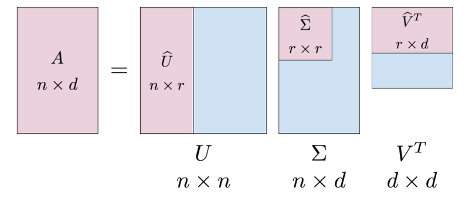
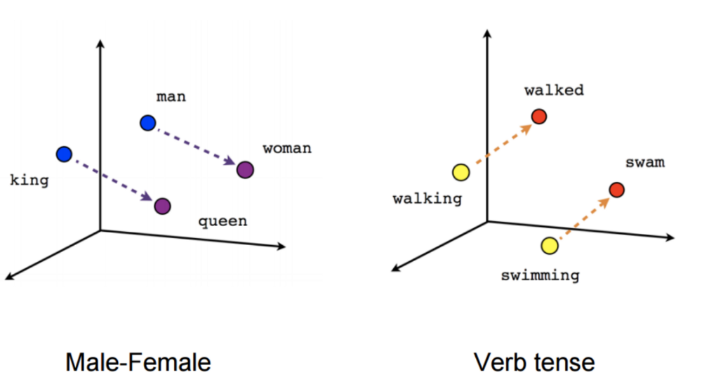
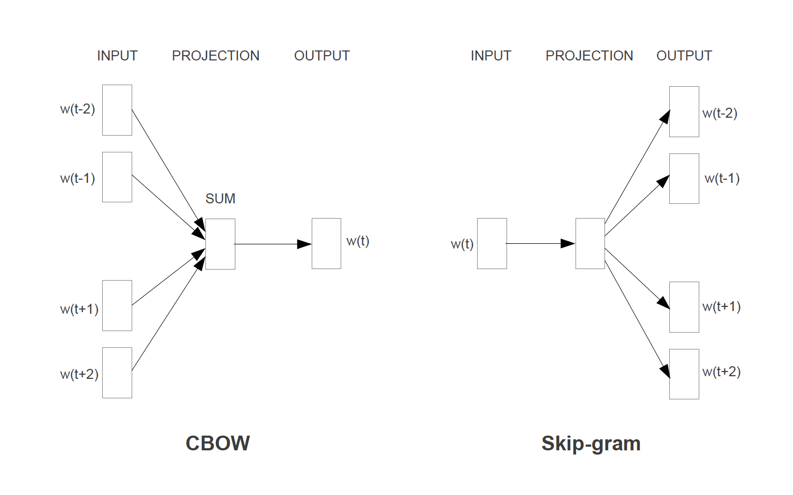
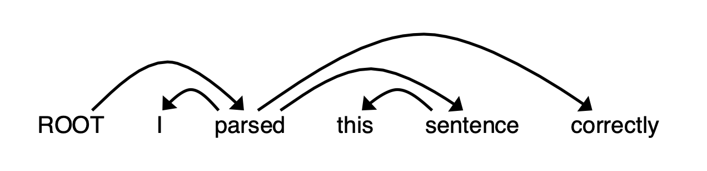
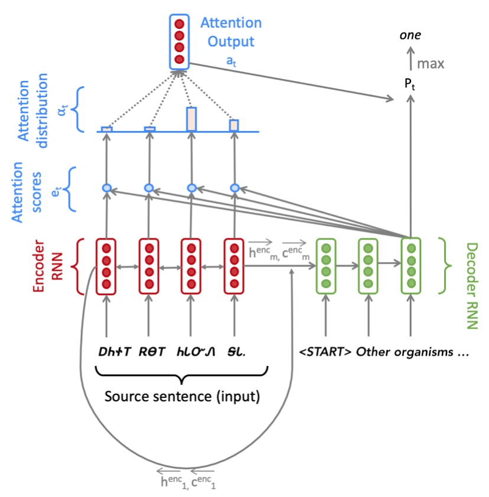
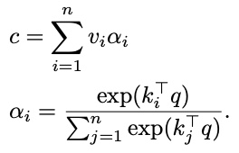

# Stanford Course CS224n - Natural Language Processing with Deep Learning (Winter 2021)

These are my solutions to the assignments of [CS224n (Natural Language Processing with Deep Learning)](http://web.stanford.edu/class/cs224n/) offered by Stanford University in Winter 2021.
There are five assignments in total. Here is a brief description of each one of these assignments:

## Assignment 1. Word Embeddings

- This assignment [[notebook](a1/exploring_word_vectors_solved.ipynb), [PDF](a1/CS224nAssignment1.pdf)] has two parts which deal with representing words with dense vectors (i.e., word vectors or word embeddings). Word vectors are often used as a fundamental component for downstream NLP tasks, e.g. question answering, text generation, translation, etc., so it is important to build some intuitions as to their strengths and weaknesses. Here, you will explore two types of word vectors: those derived from co-occurrence matrices (which uses SVD), and those derived via GloVe (based on maximum-likelihood training in ML). 

### 1. Count-Based Word Vectors

- Many word vector implementations are driven by the idea that similar words, i.e., (near) synonyms, will be used in similar contexts. As a result, similar words will often be spoken or written along with a shared subset of words, i.e., contexts. By examining these contexts, we can try to develop embeddings for our words. With this intuition in mind, many "old school" approaches to constructing word vectors relied on word counts. Here we elaborate upon one of those strategies, co-occurrence matrices.
- In this part, you will use co-occurence matrices to develop dense vectors for words. A co-occurrence matrix counts how often different terms co-occur in different documents. To derive a co-occurence matrix, we use a window with a fixed size <i>w</i>, and then slide this window over all of the documents. Then, we count how many times two different words <i>vi</i> and <i>vj</i> occurs with each other in a window, and put this number in the <i>(i, j)th</i> entry of the matrix. We then run dimensionality reduction on the co-occurence matrix using singular value decomposition. We then select the top <i>r</i> components after the decomposition and thus, derive <i>r</i>-dimensional embeddings for words.

### 2. Prediction (or Maximum Likelihood)-Based Word Vectors: Word2Vec

- Prediction-based word vectors (which also utilize the benefit of counts) such as Word2Vec and GloVe have demonstrated better performance compared to co-occurence matrices. In this part, you will explore pretrained GloVe embeddings using the [Gensim](https://radimrehurek.com/gensim/) package. Initially, you'll have to reduce the dimensionality of word vectors using SVD from 300 to 2 to be able to vizualize and analyze these vectors. Next, you'll find the closest word vectors to a given word vector. You'll then get to know words with multiple meanings (polysemous words). You will also experiment with the analogy task, introduced for the first time in the Word2Vec paper [(Mikolov et al. 2013)](https://arxiv.org/pdf/1301.3781.pdf%5D). The task is simple: given words <i>x, y</i>, and <i>z</i>, you have to find a word <i>w</i> such that the following relationship holds: <i>x</i> is to <i>y</i> like <i>z</i> is to <i>w</i>. For example, Rome is to Italy like D.C. is to the United States. You will find that solving this task with Word2Vec vectors is easy and is just a simple addition and subtraction of vectors, which is a nice feature of word embeddings.
- If you’re feeling adventurous, challenge yourself and try reading [GloVe’s original paper](https://nlp.stanford.edu/pubs/glove.pdf).

## Assignment 2. Understanding and Implementing Word2Vec

- In this [assignment](a2/CS224nAssignment2.pdf), you will get familiar with the Word2Vec algorithm. The key insight behind Word2Vec is that "a word is known by the company it keeps". There are two models introduced by the Word2Vec paper based on this idea: (i) the skip-gram model and (ii) the Continuous Bag Of Words (CBOW) model. 
- In this assignment, you'll be implementing the skip-gram model using NumPy. You have to implement the both version of Skip-gram; the first one is with the naive Softmax loss and the second one -- which is much faster -- with the negative sampling loss. Your implementation of the first version is just sanity-checked on a small dataset, but you have to run the second version on the Stanford Sentiment Treebank dataset. 
- It is highly recommend for anyone interested in gaining a deep understanding of Word2Vec to first do the theoretical part of this assignment and only then proceed to the practical part.

## Assignment 3. Neural Dependency Parsing

- If you have take a compiler course before, you have definitely heard the term "parsing". This assignment is about "dependency parsing" where you train a model that can specify the dependencies. If you remember "Shift-Reduce Parser" from your Compiler class, then you will find the ideas here quite familiar. The only difference is that we shall use a neural network to find the dependencies. In this assignment, you will build a neural dependency parser using PyTorch. 
- In Part 1 of this [assignment](a3/CS224nAssignment3.pdf), you will learn about two general neural network techniques (Adam Optimization and Dropout). In Part 2 of this assignment, you will implement and train a dependency parser using the techniques from Part 1, before analyzing a few erroneous dependency parses. 
- Both the Adam optimizer and Dropout will be used in the neural dependency parser you are going to implement with PyTorch. The parser will do one of the following three moves: 1) Shift 2) Left-arc 3) Right-arc. You can read more about the details of these three moves in the [handout](a3/a3.pdf) of the assignment. What your network should do is to predict one of these moves at every step. For predicting each move, your model needs features which are going to be extracted from the stack and buffer of each stage (you maintain a stack and buffer during parsing, to know what you have already parsed and what is remaining for parsing, respectively). The good news is that the code for extracting features is given to you to help you just focus on the neural network part! There are lots of hints throughout the assignment -- as this is the first assignment in the course where students work with PyTorch -- that walk you through implementing each part. 

## Assignment 4. Seq2Seq Machine Translation Model with Multiplicative Attention

- This [assignment](a4/CS224nAssignment4.pdf) is split into two sections: Neural Machine Translation with RNNs and Analyzing NMT Systems. The first is primarily coding and implementation focused, whereas the second entirely consists of written, analysis questions.

## Assignment 5. Self-Attention, Transformers, and Pretraining

- This [assignment](a5/CS224nAssignment5.pdf) is an investigation into Transformer self-attention building blocks, and the effects of pre- training. It covers mathematical properties of Transformers and self-attention through written questions. Further, you’ll get experience with practical system-building through repurposing an existing codebase. The assignment is split into a written (mathematical) part and a coding part, with its own written questions. Here’s a quick summary:
  1. Mathematical exploration: What kinds of operations can self-attention easily implement? Why should we use fancier things like multi-headed self-attention? This section will use some mathematical investigations to illuminate a few of the motivations of self-attention and Transformer networks.
  2. Extending a research codebase: In this portion of the assignment, you’ll get some experience and intuition for a cutting-edge research topic in NLP: teaching NLP models facts about the world through pretraining, and accessing that knowledge through finetuning. You’ll train a Transformer model to attempt to answer simple questions of the form “Where was person [x] born?” – without providing any input text from which to draw the answer. You’ll find that models are able to learn some facts about where people were born through pretraining, and access that information during fine-tuning to answer the questions.
- Then, you’ll take a harder look at the system you built, and reason about the implications and concerns about relying on such implicit pretrained knowledge.

## Handouts

 - [x] Assignment 1: Intro to word vectors [`a1/exploring_word_vectors.ipynb`](a1/exploring_word_vectors.ipynb)
 - [x] Assignment 2: Training Word2Vec [`a2/a2.pdf`](a2/a2.pdf)
 - [x] Assignment 3: Dependency parsing [`a3/a3.pdf`](a3/a3.pdf)
 - [x] Assignment 4: Neural machine translation with seq2seq and attention [`a4/a4.pdf`](a4/a4.pdf)
 - [x] Assignment 5: Neural machine translation with sub-word modeling [`a5/a5.pdf`](a5/a5.pdf)
 - [x] Project: [SQuAD](https://rajpurkar.github.io/SQuAD-explorer/) - Stanford Question Asking Dataset [`project/proposal.pdf`](project/proposal.pdf)

## Prerequisites

- Proficiency in Python.
  All class assignments will be in Python (using NumPy and PyTorch). If you need to remind yourself of Python, or you're not very familiar with NumPy, attend the Python review session in week 1 (listed in the schedule). If you have a lot of programming experience but in a different language (e.g. C/C++/Matlab/Java/Javascript), you will probably be fine.
- College Calculus, Linear Algebra (e.g. MATH51, CME100).
  You should be comfortable taking (multivariable) derivatives and understanding matrix/vector notation and operations.
- Basic Probability and Statistics (e.g. CS109 or equivalent)
  You should know basics of probabilities, Gaussian distributions, mean, standard deviation, etc.
- Foundations of Machine Learning (e.g. CS221 or CS229).
  We will be formulating cost functions, taking derivatives and performing optimization with gradient descent. If you already have basic machine learning and/or deep learning knowledge, the course will be easier; however it is possible to take CS224n without it. There are many introductions to ML, in webpage, book, and video form. One approachable introduction is Hal Daumé's in-progress "A Course in Machine Learning". Reading the first 5 chapters of that book would be good background. Knowing the first 7 chapters would be even better!

## Course Description

- This course was formed in 2017 as a merger of the earlier [CS224n](https://web.stanford.edu/class/archive/cs/cs224n/cs224n.1162) (Natural Language Processing) and [CS224d](http://cs224d.stanford.edu/) (Natural Language Processing with Deep Learning) courses. Below you can find archived websites and student project reports.
- Natural language processing (NLP) is one of the most important technologies of the information age, and a crucial part of artificial intelligence. Applications of NLP are everywhere because people communicate almost everything in language: web search, advertising, emails, customer service, language translation, medical reports, etc. In recent years, Deep Learning approaches have obtained very high performance across many different NLP tasks, using single end-to-end neural models that do not require traditional, task-specific feature engineering. In this course, students will gain a thorough introduction to cutting-edge research in Deep Learning for NLP. Through lectures, assignments and a final project, students will learn the necessary skills to design, implement, and understand their own neural network models. CS224n uses PyTorch.

## Resources

Lecture notes, assignments and other materials can be downloaded from the [course webpage](http://web.stanford.edu/class/cs224n/).
- Lectures: [YouTube](https://www.youtube.com/watch?v=8rXD5-xhemo&list=PLoROMvodv4rOhcuXMZkNm7j3fVwBBY42z)
- Schedule: [Stanford CS224n](http://web.stanford.edu/class/cs224n/index.html#schedule)
- Projects: [Stanford CS224n](http://web.stanford.edu/class/cs224n/project.html)

## Disclaimer

I recognize the hard time people spend on building intuition, understanding new concepts and debugging assignments. The solutions uploaded here are **only for reference**. They are meant to unblock you if you get stuck somewhere. Please do not copy any part of the solutions as-is (the assignments are fairly easy if you read the instructions carefully).